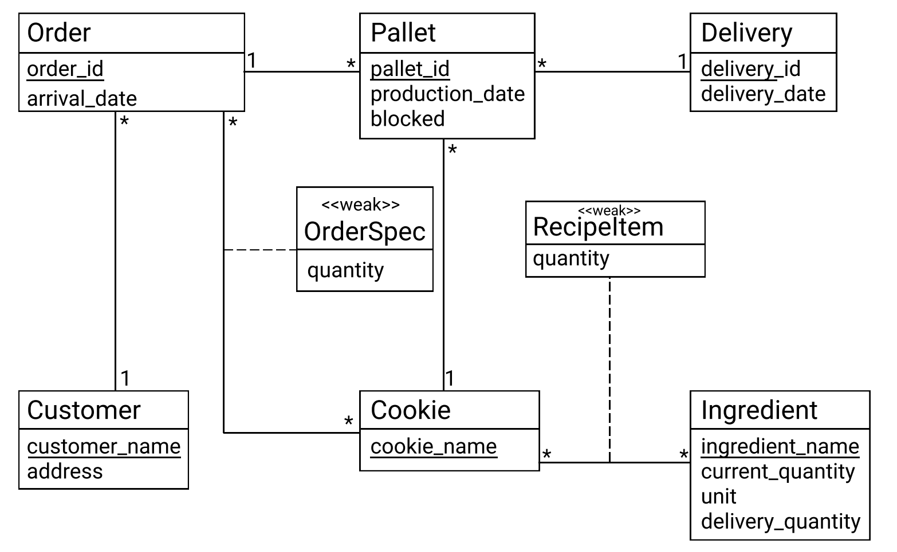

# EDAF75, project report

This is the report for

 + Isak Marklund, `is4484ma-s`
 + Edward Sjöblom, `ed2576sj-s`

We solved this project on our own, except for:

 + The Peer-review meeting

## ER-design

The model is in the file [`model.png`](model.png):

<center>
    
</center>

## Relations

The ER-model above gives the following relations (neither
[Markdown](https://docs.gitlab.com/ee/user/markdown.html)
nor [HTML5](https://en.wikipedia.org/wiki/HTML5) handles
underlining withtout resorting to
[CSS](https://en.wikipedia.org/wiki/Cascading_Style_Sheets),
so we use bold face for primary keys, italicized face for
foreign keys, and bold italicized face for attributes which
are both primary keys and foreign keys):

+ orders(**order_id**, arrival_date, _customer_name_)
+ pallets(**pallet_id**, production_date, blocked, _order_id_, _delivery_id_, _cookie_name_)
+ deliveries(**delivery_id**, delivery_date)
+ order_specs(**_order_id_**, **_cookie_name_**, quantity)
+ recipe_items(**_cookie_name_**, **_ingredient_name_**, quantity)
+ customers(**customer_name**, address)
+ cookies(**cookie_name**)
+ ingredients(**ingredient_name**, current_quantity, unit, delivery_quantity)

## Scripts to set up database

The scripts used to set up and populate the database are in:

 + [`create-schema.sql`](create-schema.sql) (defines the tables), and
 + [`initial-data.sql`](initial-data.sql) (inserts data).

So, to create and initialize the database, we run:

```shell
sqlite3 krusty-db.sqlite < create-schema.sql
sqlite3 krusty-db.sqlite < initial-data.sql
```


## How to compile and run the program

After creating and initializing the database. The REST API can be run from the command line through:
```
python api.py
```

This command will work if you have python installed on your computer.

